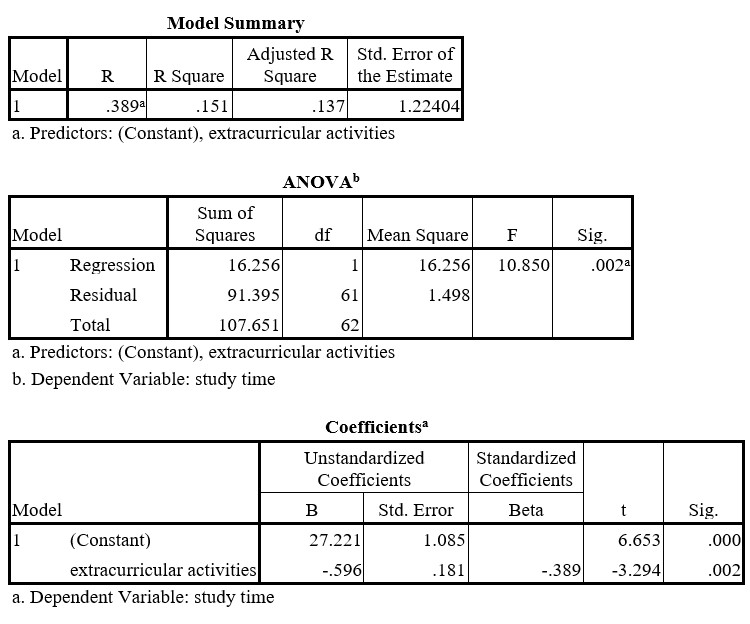

```{r, echo = FALSE, results = "hide"}
include_supplement("uu-Standardized-coefficient-801-en-tabel.jpg", recursive = TRUE)
```

Question
========
  
Sommige docenten willen graag weten of er een verband is tussen de tijd die studenten besteden aan georganiseerde buitenschoolse activiteiten en de tijd die ze besteden aan studeren. Vijftig studenten werd gevraagd om gedurende een aantal weken bij te houden hoeveel tijd ze besteedden aan buitenschoolse activiteiten en aan studeren. Het gemiddelde aantal uren per week werd voor beide berekend. SPSS werd gebruikt om de gegevens te analyseren. 



Wat is de waarde van de correlatiecoëfficiënt tussen de tijd besteed aan buitenschoolse activiteiten en de tijd besteed aan studeren? 
Answerlist
----------


Solution
========
  

$r=-.389$

Meta-information
================
exname: uu-Standardized-coefficient-801-nl
extype: string
exsolution: -.389
exsection: Inferential Statistics/Regression/Standardized coefficient
exextra[ID]: d4049
exextra[Type]: Interpretating output
exextra[Program]: SPSS
exextra[Language]: Dutch
exextra[Level]: Statistical Literacy
