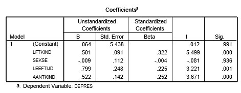

```{r, echo = FALSE, results = "hide"}
include_supplement("uu-Standardized-coefficient-802-tabel.jpg", recursive = TRUE)
```

Question
========
Using data from a study of depression in young children (up to 13 years of age), an analysis examined the influence of: age of child (AgeChild), sex of child (Gender), age of mother (AgeM), and number of children in the family (NumChild). The table below shows the regression coefficients of the four predictors for the dependent variable DEPRES.

Which predictor (given the other three predictors) contributes the most to the prediction of the dependent variable DEPRES?



Answerlist
----------
* AgeChild
* Gender
* AgeM
* NumChild


Solution
========

Meta-information
================
exname: uu-Standardized-coefficient-802-en
extype: schoice
exsolution: 1000
exsection: Inferential Statistics/Regression/Standardized coefficient
exextra[Type]: Interpretating output
exextra[Program]: SPSS
exextra[Language]: English
exextra[Level]: Statistical Literacy
