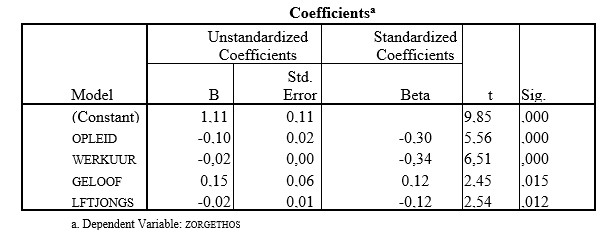

```{r, echo = FALSE, results = "hide"}
include_supplement("uu-Standardized-coefficient-803-nl-tabel.jpg", recursive = TRUE)
```

Question
========
Some background characteristics of mothers with young children were examined to see if they could explain the variance in the degree of care ghettos. The output below presents the results of the analysis for the following characteristics:
- care ethos: importance one attaches to caregiving tasks; the higher the score the more importance one attaches to caregiving tasks,
- education: education respondent; 1 = low to 8 = high,
- working hours: number of hours of work per week,
- faith: religion; 0 = none and 1 = yes,
- ageyoung: age of youngest child in years.

Which predictor (given the other three) is the strongest predictor of the variable care ethos?




Answerlist
----------
* Training
* Work hour
* Faith
* AgeYoung


Solution
========

Meta-information
================
exname: uu-Standardized-coefficient-803-en
extype: schoice
exsolution: 0100
exsection: Inferential Statistics/Regression/Standardized coefficient
exextra[ID]: 3f8e2
exextra[Type]: Interpretating output
exextra[Language]: English
exextra[Level]: Statistical Literacy
