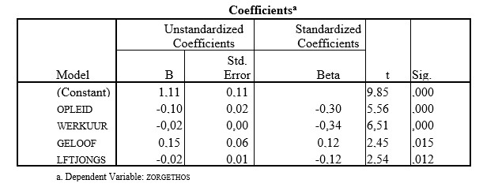

```{r, echo = FALSE, results = "hide"}
include_supplement("uu-Standardized-coefficient-803-nl-tabel.jpg", recursive = TRUE)
```


Question
========
Van enkele achtergrondkenmerken van moeders met jonge kinderen is nagegaan of ze de variantie in de mate van zorgethos kunnen verklaren. In de output hieronder vind je de resultaten van de analyse voor de volgende kenmerken: 
- zorgethos: belang dat men hecht aan zorgtaken; hoe hoger de score hoe meer belang men hecht aan zorgtaken,
- opleid: opleiding respondent; 1 = laag tot en met 8 = hoog,
- werkuur: aantal uren werk per week,
- geloof: geloofsovertuiging; 0 = geen en 1 = wel,
- lftjong:leeftijd jongste kind in jaren.

Welke predictor (gegeven de overige drie) is de sterkste voorspeller van de variabele zorgethos?




Answerlist
----------
* opleid
* werkuur
* geloof
* lftjongs


Solution
========


Meta-information
================
exname: uu-Standardized-coefficient-803-nl.Rmd
extype: schoice
exsolution: 0100
exsection: Inferential Statistics/Regression/Standardized coefficient
exextra[Type]: Interpretating output
exextra[Language]: Dutch
exextra[Level]: Statistical Literacy