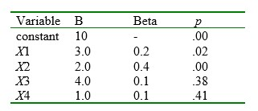

```{r, echo = FALSE, results = "hide"}
include_supplement("uu-Standardized-coefficient-804-nl-tabel.jpg", recursive = TRUE)
```


Question
========
In de onderstaande tabel zie je een deel van de uitvoer van een multipele regressie-analyse. 



Welke van de vier onafhankelijke variabelen is de beste voorspeller (predictor)?

Answerlist
----------
* X1
* X2
* X3
* X4


Solution
========


Meta-information
================
exname: uu-Standardized-coefficient-804-nl.Rmd
extype: schoice
exsolution: 0100
exsection: Inferential Statistics/Regression/Standardized coefficient
exextra[Type]: Interpretating output
exextra[Language]: Dutch
exextra[Level]: Statistical Literacy