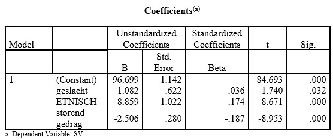

```{r, echo = FALSE, results = "hide"}
include_supplement("uu-Standardized-coefficient-805-nl-tabel.jpg", recursive = TRUE)
```

Question
========
The table below is always part of the output SPSS gives when you run a multiple regression analysis. The dependent variable is school performance (SV), the independent variables are: gender (0 = girl, 1 = boy), ethnicity (0 = other origin, 1 = Dutch) and disruptive behavior (higher score corresponds to more disruptive behavior). 



If all observed scores on the variable disruptive behavior listed in the data matrix are divided by two, then

Answerlist
----------
* Changes the B value of the variable disruptive behavior.
* Changes the Beta value of the variable disruptive behavior.
* Changes the significance of the B value of the variable disruptive behavior.
* Several of these answers are correct.


Solution
========

Meta-information
================
exname: uu-Standardized-coefficient-805-en
extype: schoice
exsolution: 1000
exsection: Inferential Statistics/Regression/Standardized coefficient
exextra[Type]: Interpretating output
exextra[Program]: SPSS
exextra[Language]: English
exextra[Level]: Statistical Literacy