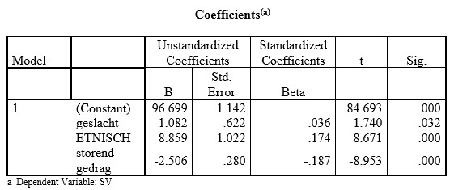

```{r, echo = FALSE, results = "hide"}
include_supplement("uu-Standardized-coefficient-805-nl-tabel.jpg", recursive = TRUE)
```


Question
========
Onderstaande tabel is altijd onderdeel van de uitvoer die SPSS geeft als je een multipele regressieanalyse uitvoert. De afhankelijke variabele is schoolprestaties (SV), de onafhankelijke variabelen zijn: geslacht (0 = meisje, 1 = jongen), etnische afkomst (0 = andere afkomst, 1 = Nederlands) en storend gedrag (hogere score komt overeen met meer storend gedrag). 



Indien alle geobserveerde scores op de variabele storend gedrag die in de datamatrix staan, door twee worden gedeeld, dan

Answerlist
----------
* verandert de B-waarde van de variabele storend gedrag.
* verandert de Beta-waarde van de variabele storend gedrag.
* verandert de significantie van de B-waarde van de variabele storend gedrag.
* meerdere van deze antwoorden zijn goed.


Solution
========


Meta-information
================
exname: uu-Standardized-coefficient-805-nl.Rmd
extype: schoice
exsolution: 1000
exsection: Inferential Statistics/Regression/Standardized coefficient
exextra[ID]: ed0cf
exextra[Type]: Interpretating output
exextra[Program]: SPSS
exextra[Language]: Dutch
exextra[Level]: Statistical Literacy