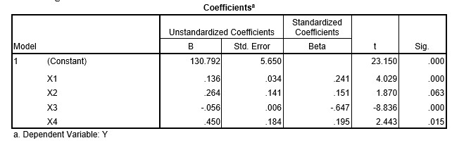

```{r, echo = FALSE, results = "hide"}
include_supplement("uu-Standardized-coefficient-806-nl-tabel.jpg", recursive = TRUE)
```

Question
========
A dependent variable is predicted using four predictors. The analysis leads to the following results:



Which predictor is the best predictor in this model?

Answerlist
----------
* X1
* X2
* X3
* X4


Solution
========

Meta-information
================
exname: uu-Standardized-coefficient-806-en
extype: schoice
exsolution: 0010
exsection: Inferential Statistics/Regression/Standardized coefficient
exextra[ID]: 40fc3
exextra[Type]: Interpretating output
exextra[Program]: SPSS
exextra[Language]: English
exextra[Level]: Statistical Literacy