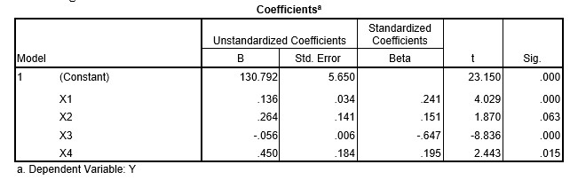

```{r, echo = FALSE, results = "hide"}
include_supplement("uu-Standardized-coefficient-806-nl-tabel.jpg", recursive = TRUE)
```


Question
========
Een afhankelijke variabele wordt voorspeld aan de hand van vier predictoren. De analyse leidt tot de volgende resultaten:



Welke voorspeller is de beste voorspeller in dit model?

Answerlist
----------
* X1
* X2
* X3
* X4


Solution
========


Meta-information
================
exname: uu-Standardized-coefficient-806-nl.Rmd
extype: schoice
exsolution: 0010
exsection: Inferential Statistics/Regression/Standardized coefficient
exextra[Type]: Interpretating output
exextra[Program]: SPSS
exextra[Language]: Dutch
exextra[Level]: Statistical Literacy