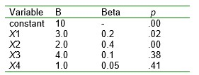

```{r, echo = FALSE, results = "hide"}
include_supplement("uu-Standardized-coefficient-807-nl-tabel.jpg", recursive = TRUE)
```

Question
========
The table shows part of the output of a multiple regression analysis. 



Of the four independent variables, the best predictor (predictor) is:

Answerlist
----------
* X1
* X2
* X3
* X4


Solution
========

Meta-information
================
exname: uu-Standardized-coefficient-807-en
extype: schoice
exsolution: 0100
exsection: Inferential Statistics/Regression/Standardized coefficient
exextra[ID]: 5b78f
exextra[Type]: Interpretating output
exextra[Language]: English
exextra[Level]: Statistical Literacy