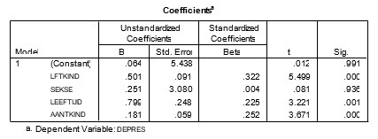

```{r, echo = FALSE, results = "hide"}
include_supplement("uu-Standardized-coefficient-808-nl-tabel.jpg", recursive = TRUE)
```

Question
========
Using the data from a study of depression in young children (up to 13 years), an analysis examined the influence of: age of child (ChildAge), sex of child (Gender), age of mother (AgeM), number of children in the family (NumChild). In the table below, the regression coefficients of the four predictors for the dependent variable DEPRES. 



Which predictor (given the other three predictors) contributes the least to the prediction of the dependent variable DEPRES?

Answerlist
----------
* ChildAge
* Gender
* AgeM
* NumChild


Solution
========

Meta-information
================
exname: uu-Standardized-coefficient-808-en
extype: schoice
exsolution: 0100
exsection: Inferential Statistics/Regression/Multiple linear regression
exextra[Type]: Interpretating output
exextra[Program]: SPSS
exextra[Language]: English
exextra[Level]: Statistical Literacy
