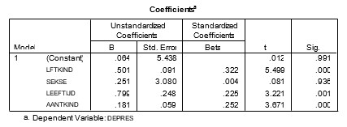

```{r, echo = FALSE, results = "hide"}
include_supplement("uu-Standardized-coefficient-808-nl-tabel.jpg", recursive = TRUE)
```


Question
========
Met de gegevens van een onderzoek naar depressie bij jonge kinderen (tot 13 jaar) is in een analyse de invloed nagegaan van: leeftijd kind (LFTKIND), sekse kind (SEKSE), leeftijd moeder (LEEFTIJD), aantal kinderen in het gezin (AANTKIND). 
In onderstaande tabel de regressiecoëfficiënten van de vier predictoren voor de afhankelijke variabele DEPRES. 



Welke predictor draagt (gegeven de overige drie predictoren) het minst bij aan de voorspelling van de afhankelijke variabele DEPRES?

Answerlist
----------
* LFTKIND
* SEKSE
* LEEFTIJD
* AANTKIND


Solution
========


Meta-information
================
exname: uu-Standardized-coefficient-808-nl.Rmd
extype: schoice
exsolution: 0100
exsection: Inferential Statistics/Regression/Multiple linear regression
exextra[Type]: Interpretating output
exextra[Program]: SPSS
exextra[Language]: Dutch
exextra[Level]: Statistical Literacy