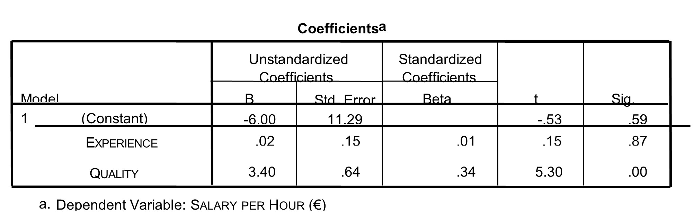

```{r, echo = FALSE, results = "hide"}
include_supplement("uu-Standardized-coefficient-809-nl-tabel.jpg", recursive = TRUE)
```

Question
========
The hourly wage of teachers (SALERY PER HOUR) can be predicted with a multiple regression model from the number of years of experience a teacher has (EXPERIENCE) and how well the teacher is perceived (QUALITY). The quality of the teacher is the average peer rating. The SPSS output of the regression analysis is shown. 



Which of the two variables, EXPERIENCE or QUALITY, is the most important predictor of SALARY PER HOUR and why?

Answerlist
----------
* The variable QUALITY, because this variable has the highest standardized regression coefficient of the two predictors.
* The variable QUALITY, because this variable has the highest regression coefficient of the two predictors.
* The variable EXPERIENCE, because this variable has the highest p-value of the two predictors.
* The variable EXPERIENCE, because this variable has the smallest standard error (Std. Error) of the two predictors.


Solution
========
To determine which variable is the most significant predictor, 3 aspects can be looked at:
- p-value: a more significant predictor is more important than a less significant predictor. A smaller p-value means more significance (because of this, C is erroneous, because wrong-sum).
- t-value: a higher t-value means the predictor is more significant. This option is not among the answer options.
- Beta: standardized regression coefficients are given here. A higher beta means a more important predictor. This leads to the correct answer: A. Both regression coefficient (B) and standard error (Std. Error) cannot be used to locate the most significant predictor without additional information about the scales.

Meta-information
================
exname: uu-Standardized-coefficient-809-en
extype: schoice
exsolution: 1000
exsection: Inferential Statistics/Regression/Standardized coefficient
exextra[Type]: Interpretating output
exextra[Program]: SPSS
exextra[Language]: English
exextra[Level]: Statistical Literacy