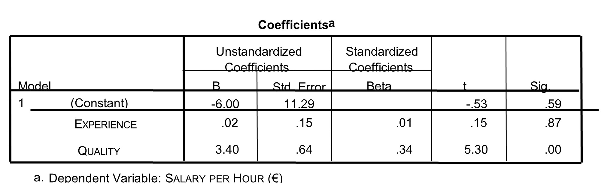

```{r, echo = FALSE, results = "hide"}
include_supplement("uu-Standardized-coefficient-809-nl-tabel.jpg", recursive = TRUE)
```


Question
========
Het uurloon van docenten (SALERY PER HOUR) kan met een multipele regressiemodel voorspeld worden uit het aantal jaren ervaring dat een docent heeft (EXPERIENCE) en hoe goed de docent wordt gevonden (QUALITY). De kwaliteit van de docent is de gemiddelde beoordeling door collega's. De SPSS uitvoer van de regressieanalyse is weergegeven. 



Welke van de twee variabelen, EXPERIENCE of QUALITY, is de belangrijkste voorspeller voor SALARY PER HOUR en waarom?

Answerlist
----------
* De variabele QUALITY, want deze variabele heeft de hoogste gestandaardiseerde regressiecoëfficiënt van de twee predictoren.
* De variabele QUALITY, want deze variabele heeft de hoogste regressiecoëfficiënt van de twee predictoren.
* De variabele EXPERIENCE, want deze variabele heeft de hoogste p-waarde van de twee predictoren.
* De variabele EXPERIENCE, want deze variabele heeft de kleinste standaardfout (Std. Error) van de twee predictoren.


Solution
========
Om te bepalen welke variabele de belangrijkste voorspeller is, kan naar 3 aspecten gekeken worden:
- p-waarde: een meer significante predictor is belangrijker dan een minder significante predictor. Een kleinere p-waarde betekent meer significantie (hierdoor is C foutief, want verkeerd-om).
- t-waarde: een hogere t-waarde betekent dat de predictor belangrijker is. Deze optie staat niet tussen de antwoordmogelijkheden.
- Beta: hier worden de gestandaardiseerde regressiecoëfficiënten gegeven. Een hogere beta betekent een meer belangrijke voorspeller. Dit leidt tot het correcte antwoord: A.
Zowel de regressiecoëfficiënt (B) als de standaardfout (Std. Error) kunnen niet gebruikt worden om de meest belangrijke voorspeller te lokaliseren zonder aanvullende informatie over de schalen.


Meta-information
================
exname: uu-Standardized-coefficient-809-nl.Rmd
extype: schoice
exsolution: 1000
exsection: Inferential Statistics/Regression/Standardized coefficient
exextra[ID]: 0fc38
exextra[Type]: Interpretating output
exextra[Program]: SPSS
exextra[Language]: Dutch
exextra[Level]: Statistical Literacy