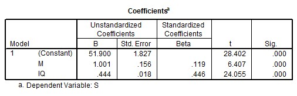

```{r, echo = FALSE, results = "hide"}
include_supplement("uu-Standardized-coefficient-810-nl-tabel.jpg", recursive = TRUE)
```

Question
========
The influence of motivation (M) and intelligence (IQ) on study success (S) can be analyzed via multiple regression. A regression analysis with SPSS gives the output below.



In the regression model, which of the two predictors, M (Motivation) or I (Intelligence), is the most important predictor of S (Study Success) and why?

Answerlist
----------
* M (Motivation), because this predictor has the lowest test size (t) out of the two.
* M (Motivation), because this predictor has the highest unstandardized regression coefficient (B) out of both.
* IQ (Intelligence), because this predictor has the smallest standard error (Std. Error) of either.
* IQ (Intelligence), because this predictor has the highest standardized regression coefficient (Beta) of either.


Solution
========
To determine which variable is the most significant predictor, 3 aspects can be looked at:
- p-value: a more significant predictor is more significant than a less significant predictor. A smaller p-value means more significance (note that in this case the p-value is not represented accurately enough to make a statement based on the p-value. In fact, the p-values rounded to 3 decimal places are the same size).
- t-value: a higher t-value means that the predictor is more important. (For this reason, answer option A is not correct, this is just the wrong way around).
- Beta: standardized regression coefficients are given here. A higher beta means a more important predictor. This leads to the correct answer: D. Both the unstandardized regression coefficient (B) and the standard error (Std. Error) cannot be used to locate the most significant predictor without additional information about the scales.

Meta-information
================
exname: uu-Standardized-coefficient-810-en
extype: schoice
exsolution: 0001
exsection: Inferential Statistics/Regression/Standardized coefficient
exextra[ID]: e78d0
exextra[Type]: Interpretating output
exextra[Program]: SPSS
exextra[Language]: English
exextra[Level]: Statistical Literacy