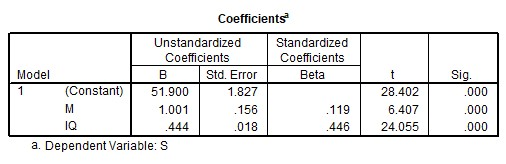

```{r, echo = FALSE, results = "hide"}
include_supplement("uu-Standardized-coefficient-810-nl-tabel.jpg", recursive = TRUE)
```


Question
========
De invloed van motivatie (M) en intelligentie (IQ) op studiesucces (S) kan via multipele regressie worden geanalyseerd. Een regressieanalyse met SPSS geeft onderstaande uitvoer.



Welke van de twee predictoren, M (Motivatie) of I (Intelligentie), is in het regressiemodel de belangrijkste voorspeller voor S (Studiesucces) en waarom?

Answerlist
----------
* M (Motivatie), want deze predictor heeft van beide de laagste toetsingsgrootheid (t).
* M (Motivatie), want deze predictor heeft van beide de hoogste ongestandaardiseerde regressiecoëfficiënt (B).
* IQ (Intelligentie), want deze predictor heeft van beide de kleinste standaardfout (Std. Error).
* IQ (Intelligentie), want deze predictor heeft van beide de hoogste gestandaardiseerde regressiecoëfficiënt (Beta).


Solution
========
Om te bepalen welke variabele de belangrijkste voorspeller is, kan naar 3 aspecten gekeken worden:
- p-waarde: een meer significante predictor is belangrijker dan een minder significante predictor. Een kleinere p-waarde betekent meer significantie (let op: in dit geval is de p-waarde niet nauwkeurig genoeg weergegeven om een uitspraak te doen op basis van de p-waarde. De p-waardes zijn afgerond op 3 decimalen namelijk even groot).
- t-waarde: een hogere t-waarde betekent dat de predictor belangrijker is. (om die reden is antwoordoptie A niet correct, dit is juist verkeerd om).
- Beta: hier worden de gestandaardiseerde regressiecoëfficiënten gegeven. Een hogere beta betekent een meer belangrijke voorspeller. Dit leidt tot het correcte antwoord: D.
Zowel de ongestandaardiseerde regressiecoëfficiënt (B) als de standaardfout (Std. Error) kunnen niet gebruikt worden om de meest belangrijke voorspeller te lokaliseren zonder aanvullende informatie over de schalen.


Meta-information
================
exname: uu-Standardized-coefficient-810-nl.Rmd
extype: schoice
exsolution: 0001
exsection: Inferential Statistics/Regression/Standardized coefficient
exextra[Type]: Interpretating output
exextra[Program]: SPSS
exextra[Language]: Dutch
exextra[Level]: Statistical Literacy