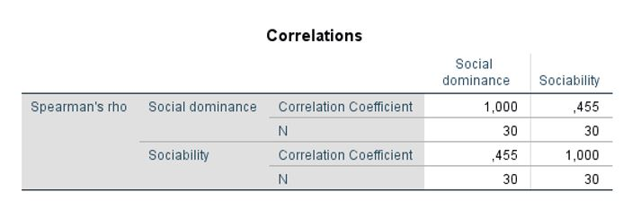

```{r, echo = FALSE, results = "hide"}
include_supplement("uu-Two-sided-hypothesis-802-nl-tabel.JPG", recursive = TRUE)
```

Question
========
  
A researcher administered questionnaires to a group of randomly selected employees at a hospital. The questionnaires measured various socio-emotional aspects. The researcher determined the rank correlation between sociability and social dominance. She wants to test whether the rank correlation is significantly different from 0. Partial SPSS output is available:



What do we know about the two-sided p-value of this test? 
Answerlist
----------
* .005 < p < .01
* .01 < p < .02
* .02 < p < .05
* .05 < p < .10

Solution
========
  
In Table B.7, at n = 30, we can look up the critical values. The p-value for such a critical value is exactly the significance shown above the column. The value .455 falls between the values .425 (.02) and .467 (.01).

Answerlist
----------
* This answer is incorrect.
* This answer is correct.
* This answer is incorrect.
* This answer is incorrect.

Meta-information
================
exname: uu-Two-sided-hypothesis-802-en
extype: schoice
exsolution: 0100
exsection: Inferential Statistics/NHST/Hypothesis/Two sided hypothesis
exextra[ID]: 05fa2
exextra[Type]: Case, Interpretating output
exextra[Program]: SPSS
exextra[Language]: English
exextra[Level]: Statistical Literacy
