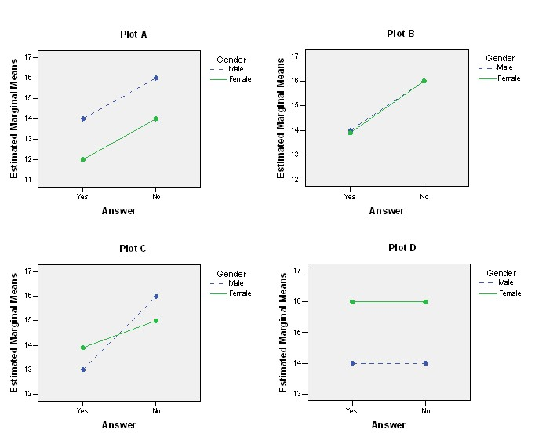

```{r, echo = FALSE, results = "hide"}
include_supplement("uu-Twoway-ANOVA-800-nl-tabel.jpg", recursive = TRUE)
```

Question
========
  
The following four interaction diagrams belong to a two-way ANOVA where outcomes were compared between males and females (male/female) and the answer to a research question (yes/no). 



Which of the four graphs shows/show a main effect for one factor but not the others? 
Answerlist
----------
* Plot A
* Plot A and Plot B
* Plot A and plot D
* Plot B, Plot C and plot D 


Solution
========
  


Answerlist
----------
* This answer is incorrect.
* This answer is incorrect.
* This answer is incorrect.
* This answer is correct.

Meta-information
================
exname: uu-Twoway-ANOVA-800-en
extype: schoice
exsolution: 0001
exsection: Inferential Statistics/Parametric Techniques/ANOVA/Twoway ANOVA
exextra[Type]: Interpretating output
exextra[Program]: SPSS
exextra[Language]: English
exextra[Level]: Statistical Literacy
