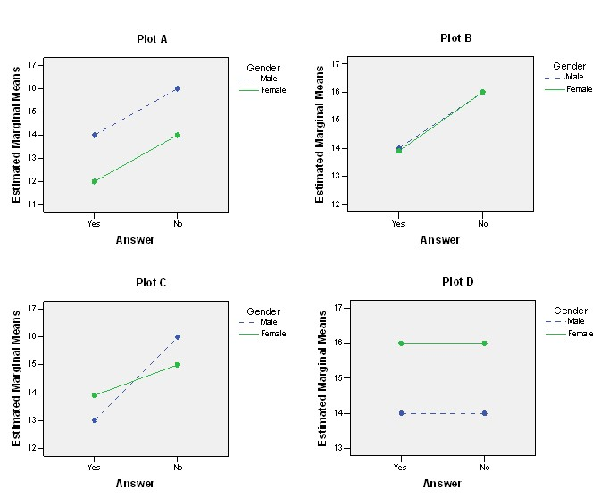

```{r, echo = FALSE, results = "hide"}
include_supplement("uu-Twoway-ANOVA-800-nl-tabel.jpg", recursive = TRUE)
```


Question
========
  
De volgende vier interactiediagrammen horen bij een tweeweg-ANOVA waar de uitkomsten werden vergeleken tussen mannen en vrouwen (male/female) en het antwoord op een onderzoeksvraag (yes/no). 



Welke van de vier grafieken laat/laten een hoofdeffect voor één factor zien maar niet voor de andere?
  
Answerlist
----------
* Plot A
* Plot A en Plot B
* Plot A en Plot D
* Plot B, Plot C en plot D 


Solution
========
  


Answerlist
----------
* Dit antwoord is incorrect.
* Dit antwoord is incorrect.
* Dit antwoord is incorrect.
* Dit antwoord is correct.


Meta-information
================
exname: uu-Twoway-ANOVA-800-nl.Rmd
extype: schoice
exsolution: 0001
exsection: Inferential Statistics/Parametric Techniques/ANOVA/Twoway ANOVA
exextra[Type]: Interpretating output
exextra[Program]: SPSS
exextra[Language]: Dutch
exextra[Level]: Statistical Literacy
