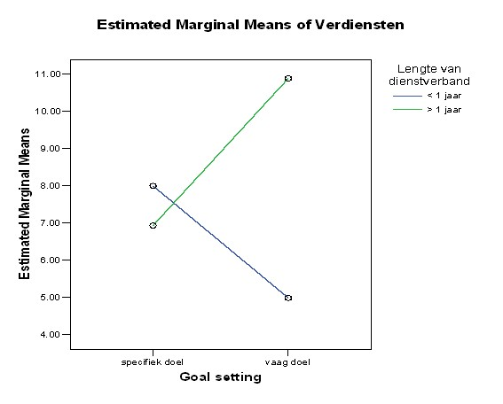

```{r, echo = FALSE, results = "hide"}
include_supplement("uu-Twoway-ANOVA-805-nl-tabel.jpg", recursive = TRUE)
```


Question
========
  
In een vervolgonderzoek herhaalt Punnet het eerste onderzoek maar wordt er een tweede variabele toegevoegd, namelijk ‘lengte van het dienstverband’. Haar verwachting is dat het effect van ‘goal setting’ verschillend is voor werkneemsters met verschillende lengte van het dienstverband. Punnet is in dit onderzoek alleen geïnteresseerd in het verschil tussen de groep die een specifiek doel kreeg en de groep die een vaag doel kreeg. 

In onderstaand gemiddeldendiagram staan de uitkomsten van dit onderzoek.




Uit bovenstaand gemiddeldendiagram blijkt dat er sprake is van:
  
Answerlist
----------
* Alleen een hoofdeffect van lengte van dienstverband
* Alleen een interactie-effect
* Zowel een hoofdeffect van lengte van dienstverband, als een interactie-effect
* Geen hoofdeffecten en ook geen interactie-effect


Solution
========
  


Answerlist
----------
* Dit antwoord is incorrect.
* Dit antwoord is incorrect.
* Dit antwoord is correct.
* Dit antwoord is incorrect.


Meta-information
================
exname: uu-Twoway-ANOVA-805-nl.Rmd
extype: schoice
exsolution: 0010
exsection: Inferential Statistics/Parametric Techniques/ANOVA/Twoway ANOVA
exextra[Type]: Interpretating graph
exextra[Program]: SPSS
exextra[Language]: Dutch
exextra[Level]: Statistical Literacy
