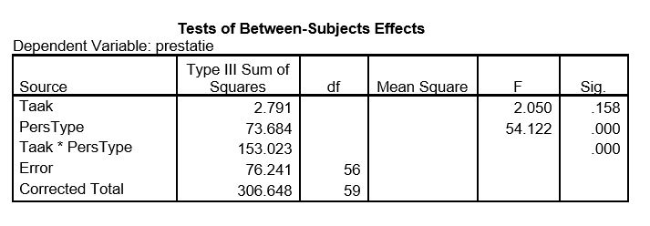

```{r, echo = FALSE, results = "hide"}
include_supplement("uu-Twoway-ANOVA-811-nl-tabel.JPG", recursive = TRUE)
```


Question
========
  
In het onderzoek van Fazio et al. (1981) vergelijken de onderzoekers het verschil in prestatie tussen twee persoonlijkheidstypes (type A en type B) op twee taken (single en multiple). De proefpersonen worden at random verdeeld over de twee condities. In de single conditie wordt de proefpersoon gevraagd fouten in een tekst aan te strepen. In de multiple conditie wordt de proefpersoon hetzelfde gevraagd maar wordt daarbij regelmatig onaangekondigd een korte andere opdracht gegeven.
In totaal wordt in beide condities 10 minuten besteed aan het opsporen van fouten in de tekst. Het aantal fouten dat correct wordt gevonden is het prestatieniveau. Er is getoetst bij $\alpha$ = 5%.

De hypotheses die de onderzoekers opstellen, zeggen dat er geen hoofdeffecten zijn en dat er wel een interactie-effect is. De hypothese die Fazio et al. opgesteld heeft over de interactie luidt: mensen met Type A persoonlijkheid worden uitgedaagd door de multiple taak en gaan daar beter van presteren; mensen met Type B persoonlijkheid worden daarentegen afgeleid door de multiple taak en gaan slechter presteren. 

Een jaar later wordt het experiment van Fazio et al. nog een keer uitgevoerd. Een deel van de SPSS-output van de tweeweg-ANOVA staat hieronder.



Wat zijn de resultaten van de tweeweg-ANOVA?

  
Answerlist
----------
* Er is alleen een hoofdeffect van taak
* Er is zowel een hoofdeffect van persoonlijkheidstype, als een interactie-effect   
* Er is alleen een interactie-effect
* Dat is op basis van bovenstaande informatie niet te bepalen

Solution
========


Answerlist
----------
* Dit antwoord is incorrect.
* Dit antwoord is correct.
* Dit antwoord is incorrect.
* Dit antwoord is incorrect.

Meta-information
================
exname: uu-Twoway-ANOVA-811-nl.Rmd
extype: schoice
exsolution: 0100
exsection: Inferential Statistics/Parametric Techniques/ANOVA/Twoway ANOVA
exextra[Type]: Case, Conceptual, Interpretating output
exextra[Program]: SPSS
exextra[Language]: Dutch
exextra[Level]: Statistical Literacy