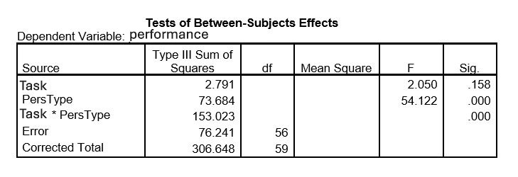

```{r, echo = FALSE, results = "hide"}
include_supplement("uu-Twoway-ANOVA-812-nl-tabel.JPG", recursive = TRUE)
```


Question
========
  
In the study by Fazio et al. (1981), researchers compare the difference in performance between two personality types (type A and type B) on two tasks (single and multiple). Subjects are randomly assigned to the two conditions. In the single condition, the subject is asked to tick off errors in a text. In the multiple condition, the subject is asked the same question but is regularly given a brief different task unannounced. A total of 10 minutes is spent in both conditions in detecting errors in the text. The number of errors found correct is the performance level. It was tested at $\alpha$ = 5%.

The hypotheses drawn up by the researchers say that there are no main effects and that there is an interaction effect. The hypothesis drawn up by Fazio et al. about the interaction reads: people with Type A personality are challenged by the multiple task and perform better because of it; on the other hand, people with Type B personality are distracted by the multiple task and perform worse.

A year later, the experiment of Fazio et al. is conducted again. Part of the SPSS output from the two-way ANOVA is below.



What is the value of the test quantity F for the interaction effect?

  
Answerlist
----------
* 2.01
* 112.40
* 1.36
* 38.26


Solution
========


Answerlist
----------
* This answer is incorrect.
* This answer is correct.
* This answer is incorrect.
* This answer is incorrect.

Meta-information
================
exname: uu-Twoway-ANOVA-812-en
extype: schoice
exsolution: 0100
exsection: Inferential Statistics/Parametric Techniques/ANOVA/Twoway ANOVA
exextra[Type]: Case, Interpretating output
exextra[Program]: SPSS
exextra[Language]: English
exextra[Level]: Statistical Literacy