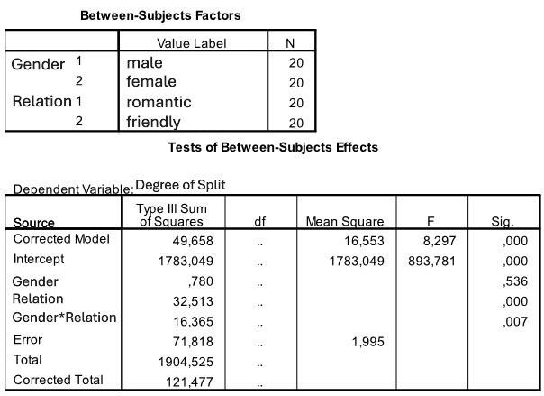

```{r, echo = FALSE, results = "hide"}
include_supplement("uu-Twoway-ANOVA-813-nl-tabel.JPG", recursive = TRUE)
```

Question
========
  
A 2006 study was conducted on feelings of regret regarding relationships and differences in those feelings between men and women. The experimental group consisted of 40 women and 29 men, mean age 19 years (sd = 1.18). Each participant completed a questionnaire according to the following instructions:

Looking back on your relationship is there anything you really regret a lot? Something you wish you had done differently. TRUE something you would have liked to do or not done.

Teun and Gijs have to do a little research for their statistics course. After reading an article about the research on regrets, they did a similar research themselves. Together they made a list of potentially embarrassing or uncomfortable situations that occur in relationships (answering the question "Am I too fat?" with "Yes," going to the sauna together, etc.). Forty fellow students are asked to participate in this study: 20 female students and 20 male students. They are asked to indicate how much they regret the situations described (TRUE where 0 means "no regret" and 10 means "very much regret"). Half of the women and half of the men are asked to answer the questions about a romantic relationship (a steady boyfriend or girlfriend), and the other half are asked to do so about a friendly relationship (a close friend or girlfriend).

SPSS output of the analysis of the collected data is given below. 


  
The degrees of freedom are missing in the SPSS output. How many degrees of freedom are there for the interaction effect between sex and type of relationship?


Answerlist
----------
* 1
* 2
* 3
* 4

Solution
========


Answerlist
----------
* This answer is correct.
* This answer is incorrect.
* This answer is incorrect.
* This answer is incorrect.

Meta-information
================
exname: uu-Twoway-ANOVA-813-en
extype: schoice
exsolution: 1000
exsection: Inferential Statistics/Parametric Techniques/ANOVA/Twoway ANOVA
exextra[ID]: 92cd7
exextra[Type]: Case, Interpretating output
exextra[Program]: SPSS
exextra[Language]: English
exextra[Level]: Statistical Literacy