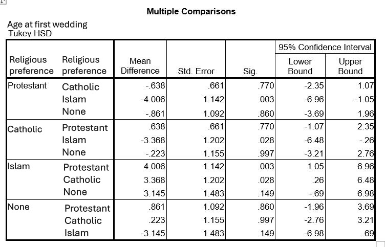

```{r, echo = FALSE, results = "hide"}
include_supplement("uu-Twoway-ANOVA-815-nl-tabel.JPG", recursive = TRUE)
```

Question
========
  
With a p-value of 0.007, we can conclude that there are significant differences between the different religious preference groups. SPSS is used to do a post hoc test. The output is shown below.


  
Which religious preference group makes the greatest contribution to rejecting the H0? 
Answerlist
----------
* Islam
* Catholic
* Protestant
* None

Solution
========
  
H0: $\mu$1 = $\mu$2 = $\mu$3 = $\mu$4 (when comparing four groups) Persons with Islam as a faith differ significantly in mean age at first marriage from those with a Protestant faith and those with a Catholic faith. There are no other differences between faith groups. Therefore, Islam makes the largest contribution to the rejection of H0.


Answerlist
----------
* This answer is correct.
* This answer is incorrect.
* This answer is incorrect.
* This answer is incorrect.

Meta-information
================
exname: uu-Twoway-ANOVA-815-en
extype: schoice
exsolution: 1000
exsection: Inferential Statistics/Parametric Techniques/ANOVA/Twoway ANOVA
exextra[ID]: e6acf
exextra[Type]: Case, Interpretating output
exextra[Program]: SPSS
exextra[Language]: English
exextra[Level]: Statistical Literacy