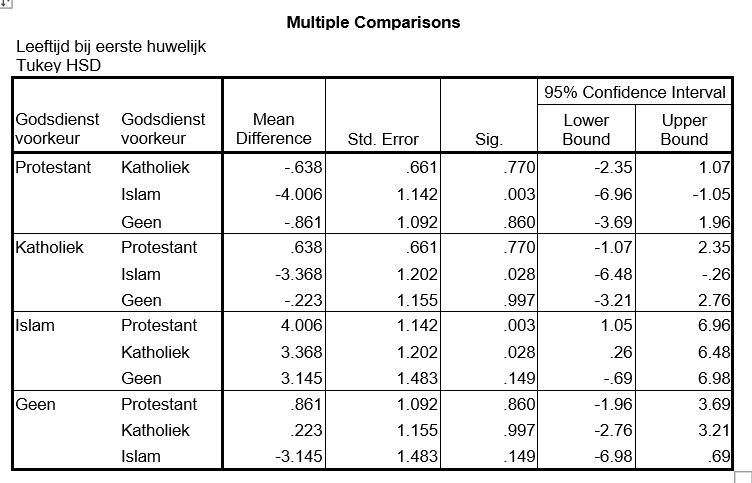

```{r, echo = FALSE, results = "hide"}
include_supplement("uu-Twoway-ANOVA-815-nl-tabel.JPG", recursive = TRUE)
```

Question
========
  
Met een p-waarde van 0.007 kunnen we de conclusie trekken dat er significante verschillen zijn tussen de verschillende godsdienstelijke voorkeursgroepen. SPSS wordt gebruikt om een post-hoc toets te doen. De output staat hieronder.


  
Welke godsdienstelijke voorkeursgroep levert de grootste bijdrage aan het verwerpen van de H0?
  
Answerlist
----------
* Islam
* Katholiek
* Protestant
* Geen

Solution
========
  
H0: $\mu$1 = $\mu$2 = $\mu$3 = $\mu$4 (bij vergelijking van vier groepen)
Personen met de islam als geloof verschillen in gemiddelde leeftijd bij eerste huwelijk  significant van mensen met een protestant geloof en mensen met een katholiek geloof. Andere verschillen tussen de geloofsgroepen zijn er niet. Daarom levert de islam de grootste bijdrage aan het verwerpen van de H0.


Answerlist
----------
* Dit antwoord is correct.
* Dit antwoord is incorrect.
* Dit antwoord is incorrect.
* Dit antwoord is incorrect.

Meta-information
================
exname: uu-Twoway-ANOVA-815-nl.Rmd
extype: schoice
exsolution: 1000
exsection: Inferential Statistics/Parametric Techniques/ANOVA/Twoway ANOVA
exextra[ID]: 5e423
exextra[Type]: Case, Interpretating output
exextra[Program]: SPSS
exextra[Language]: Dutch
exextra[Level]: Statistical Literacy