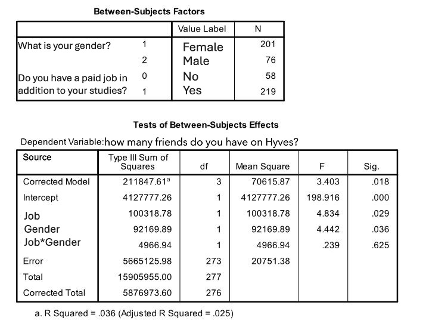

```{r, echo = FALSE, results = "hide"}
include_supplement("uu-Twoway-ANOVA-816-nl-tabel.JPG", recursive = TRUE)
```

Question
========
  
For a research assignment, a psychology student asks a large group of students at Utrecht University how many friends they have on their Hyves. He also asks whether the students have a (side) job. He expects that students with jobs will have fewer Hyves friends than students without jobs. He also wants to see if there are differences between female and male students. The results of the analysis are below. 



What is the magnitude of the effect that having a (side) job in addition to studying has on the number of Hyves friends? 
Answerlist
----------
* The effect is not significant, so the effect size need not be reported.
* 0.029
* 0.017
* 0.006

Solution
========

Answerlist
----------
* This answer is incorrect.
* This answer is incorrect.
* This answer is correct.
* This answer is incorrect.

Meta-information
================
exname: uu-Twoway-ANOVA-816-en
extype: schoice
exsolution: 0010
exsection: Inferential Statistics/Parametric Techniques/ANOVA/Twoway ANOVA
exextra[Type]: Case, Interpretating output
exextra[Program]: SPSS
exextra[Language]: English
exextra[Level]: Statistical Literacy