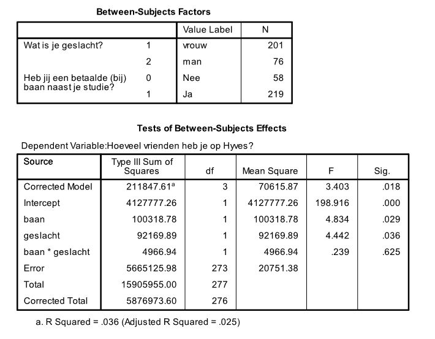

```{r, echo = FALSE, results = "hide"}
include_supplement("uu-Twoway-ANOVA-816-nl-tabel.JPG", recursive = TRUE)
```

Question
========
  
Voor een onderzoeksopdracht vraagt een psychologiestudent aan een grote groep studenten van de Universiteit van Utrecht hoeveel vrienden ze hebben op hun Hyves. Hij vraagt ook of de studenten een (bij)baan hebben. Hij verwacht dat studenten met een baan minder Hyves-vrienden zullen hebben dan studenten zonder baan. Hij wil ook kijken of er verschillen zijn tussen vrouwelijke en mannelijke studenten. De resultaten van de analyse staan hieronder. 



Wat is de grootte van het effect dat het hebben van een (bij)baan naast de studie heeft op het aantal Hyves-vrienden?
  
Answerlist
----------
* Het effect is niet significant, dus de effectgrootte hoeft niet gerapporteerd te worden.
* 0.029
* 0.017
* 0.006

Solution
========


Answerlist
----------
* Dit antwoord is incorrect.
* Dit antwoord is incorrect.
* Dit antwoord is correct.
* Dit antwoord is incorrect.

Meta-information
================
exname: uu-Twoway-ANOVA-816-nl.Rmd
extype: schoice
exsolution: 0010
exsection: Inferential Statistics/Parametric Techniques/ANOVA/Twoway ANOVA
exextra[Type]: Case, Interpretating output
exextra[Program]: SPSS
exextra[Language]: Dutch
exextra[Level]: Statistical Literacy