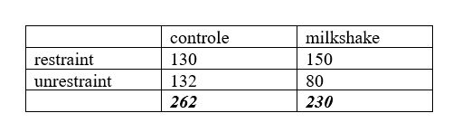

```{r, echo = FALSE, results = "hide"}
include_supplement("uu-Twoway-ANOVA-817-nl-tabel.JPG", recursive = TRUE)
```

Question
========
  
An experiment was conducted on the eating behavior of "restraint eaters. Restraint eaters are people who are chronically dieting (example from Gazzaniga and Heatherton, page 419). Twenty-five "restraint eaters" are asked to participate in a survey, supposedly a taste test for ice cream.

The participants are assigned at random to two conditions: one in which the tasters must test ice cream alone, and one in which the tasters are also allowed to drink a hefty milkshake beforehand to pass the waiting time. All participants were allowed to taste as much ice cream as necessary to arrive at a good taste assessment. The results show that subjects who were in the milkshake condition eat much more ice cream than subjects in the "taste test only" condition.


The result of the 'ice cream test' surprised the researchers and they repeated the experiment but this time with a larger group of subjects consisting of both 'restraint eaters' and people who had never followed a diet. Below is the table of outcomes. The numbers indicate the average amount of ice cream (in grams) that the participants ate in each condition.



The italicized, bold values inform the researcher:

  
Answerlist
----------
* The main effect for the experimental factor (E)
* The main effect for the person factor (P)
* The interaction effect between condition and eating patterns
* None of the above

Solution
========


Answerlist
----------
* This answer is correct.
* This answer is incorrect.
* This answer is incorrect.
* This answer is incorrect.

Meta-information
================
exname: uu-Twoway-ANOVA-817-en
extype: schoice
exsolution: 1000
exsection: Inferential Statistics/Parametric Techniques/ANOVA/Twoway ANOVA
exextra[Type]: Interpretating output, Case
exextra[Program]: SPSS
exextra[Language]: English
exextra[Level]: Statistical Literacy