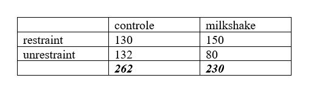

```{r, echo = FALSE, results = "hide"}
include_supplement("uu-Twoway-ANOVA-817-nl-tabel.JPG", recursive = TRUE)
```

Question
========
  
Er is een experiment gedaan naar het eetgedrag van ‘restraint eaters’. Restraint eaters zijn mensen die chronisch op dieet zijn (voorbeeld uit Gazzaniga en Heatherton, pagina 419). Aan 25 'restraint eaters' wordt gevraagd mee te doen aan een onderzoek, zogenaamd een smaaktest voor roomijs. 

De deelnemers worden at random aan twee condities toegewezen: een waarbij de proevers alleen ijs moeten testen, en een waarbij de proevers tevoren ook een flinke milkshake mogen drinken om de wachttijd door te komen. Alle deelnemers mogen net zoveel ijs proeven als nodig om tot een goede smaakbeoordeling te kunnen komen. Uit de resultaten blijkt dat proefpersonen die in de milkshake-conditie zaten veel meer ijs eten dan proefpersonen uit de ‘alleen smaaktest’-conditie.


Het resultaat van de ‘ijstest’ verraste de onderzoekers en zij herhaalden het experiment maar nu met een grotere groep proefpersonen die bestond uit zowel 'restraint eaters' als mensen die nooit een dieet hadden gevolgd. Hieronder zie je de tabel met uitkomsten. De getallen geven de gemiddelde hoeveelheid ijs (in grammen) aan, die de participanten aten in elke 	conditie.



De cursieve, vetgedrukte waarden geven de onderzoeker informatie over:

  
Answerlist
----------
* het hoofdeffect voor de experimentele factor (E)
* het hoofdeffect voor de persoons-factor (P)
* het interactie-effect tussen conditie en eetpatronen
* geen van bovenstaande

Solution
========


Answerlist
----------
* Dit antwoord is correct.
* Dit antwoord is incorrect.
* Dit antwoord is incorrect.
* Dit antwoord is incorrect.

Meta-information
================
exname: uu-Twoway-ANOVA-817-nl.Rmd
extype: schoice
exsolution: 1000
exsection: Inferential Statistics/Parametric Techniques/ANOVA/Twoway ANOVA
exextra[ID]: 948a3
exextra[Type]: Interpretating output, Case
exextra[Program]: SPSS
exextra[Language]: Dutch
exextra[Level]: Statistical Literacy