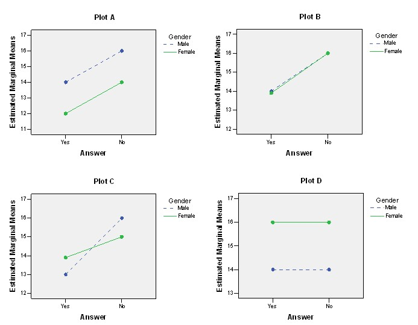

```{r, echo = FALSE, results = "hide"}
include_supplement("uu-Twoway-ANOVA-818-nl-tabel.jpg", recursive = TRUE)
```


Question
========
  
De onderstaande vier grafieken zijn interactiediagrammen die horen bij een tweeweg-ANOVA die resultaten vergelijkt tussen mannen en vrouwen (Gender: Male/Female) en tussen het antwoord op een vraag over relatieproblemen (Answer: Yes/No). Welke van de vier grafieken laten een hoofdeffect voor een factor zien, maar niet voor de andere factor?


  
Answerlist
----------
* Grafiek A en grafiek B
* Grafiek A en grafiek D
* Grafiek B, grafiek C en grafiek D 
* Alle vier de grafieken


Solution
========
  


Meta-information
================
exname: uu-Twoway-ANOVA-818-nl.Rmd
extype: schoice
exsolution: 0010
exsection: Inferential Statistics/Parametric Techniques/ANOVA/Twoway ANOVA
exextra[ID]: 5b8de
exextra[Type]: Interpretating output
exextra[Program]: SPSS
exextra[Language]: Dutch
exextra[Level]: Statistical Literacy
