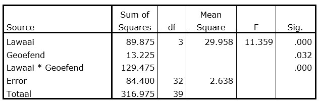

```{r, echo = FALSE, results = "hide"}
include_supplement("uu-Twoway-ANOVA-820-nl-tabel.jpg", recursive = TRUE)
```

Question
========
  
Research is conducted on the influence of background noise on the comprehension of, and understanding of texts among 6 VWO students. It is decided to conduct an experiment. Half of the students are allowed to read through the text once beforehand (Variable practiced = 1) and the other half of the students see the text for the first time during the experiment (Variable practiced = 0). Students are distributed equally across the different noise conditions. Part of the ANOVA table is shown below. 



How many different levels of background noise were used in this experiment? 
Answerlist
----------
* 3
* 4
* 7
* 8 

Solution
========

Meta-information
================
exname: uu-Twoway-ANOVA-820-en
extype: schoice
exsolution: 0100
exsection: Inferential Statistics/Parametric Techniques/ANOVA/Twoway ANOVA
exextra[ID]: 63144
exextra[Type]: Interpretating output
exextra[Program]: SPSS
exextra[Language]: English
exextra[Level]: Statistical Literacy
