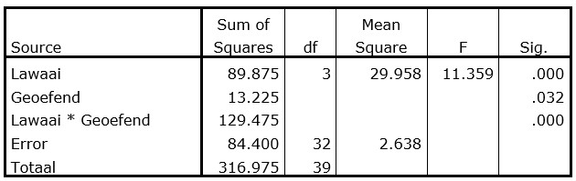

```{r, echo = FALSE, results = "hide"}
include_supplement("uu-Twoway-ANOVA-821-nl-tabel.jpg", recursive = TRUE)
```


Question
========
  
Er wordt onderzoek gedaan naar de invloed van achtergrondlawaai op het begrip van, en inzicht in teksten bij leerlingen uit 6 VWO. Er wordt besloten een experiment uit te voeren. De helft van de leerlingen mag de tekst van te voren al een keer doorlezen (Variabele geoefend = 1) en de andere helft van de leerlingen zien de tekst voor het eerst tijdens het experiment (Variabele geoefend = 0). De leerlingen worden gelijk verdeeld over de verschillende lawaaicondities. Deel van de ANOVA tabel staat hieronder. 



Wat is de waarde van de F-ratio die het effect van wel of niet oefenen toetst?
  
Answerlist
----------
* 2.51
* 2.64
* 5.01 
* 13.23


Solution
========
  


Meta-information
================
exname: uu-Twoway-ANOVA-821-nl.Rmd
extype: schoice
exsolution: 0010
exsection: Inferential Statistics/Parametric Techniques/ANOVA/Twoway ANOVA
exextra[Type]: Interpretating output
exextra[Program]: SPSS
exextra[Language]: Dutch
exextra[Level]: Statistical Literacy
