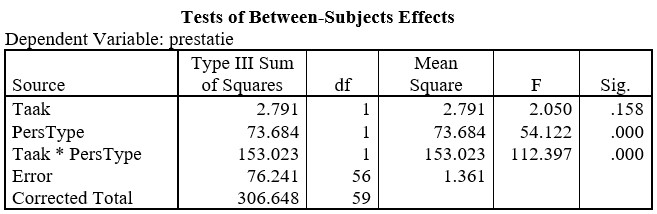

```{r, echo = FALSE, results = "hide"}
include_supplement("uu-Twoway-ANOVA-822-nl-tabel.jpg", recursive = TRUE)
```

Question
========
  
A year later, the experiment of Fazio et al. is conducted again. These are the results of the two-way Anova:



For which variable(s) do you perform a post hoc test in this situation? 
Answerlist
----------
* For the variable Task
* For the interaction between the variables Task and Personality Type
* For both Task, and Personality Type
* For neither variable

Solution
========

Meta-information
================
exname: uu-Twoway-ANOVA-822-en
extype: schoice
exsolution: 0001
exsection: Inferential Statistics/Parametric Techniques/ANOVA/Twoway ANOVA
exextra[ID]: c1d79
exextra[Type]: Interpretating output
exextra[Program]: SPSS
exextra[Language]: English
exextra[Level]: Statistical Literacy
