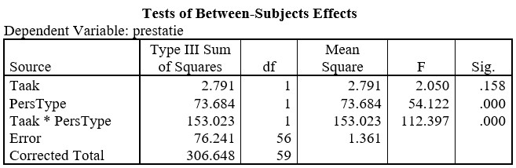

```{r, echo = FALSE, results = "hide"}
include_supplement("uu-Twoway-ANOVA-822-nl-tabel.jpg", recursive = TRUE)
```


Question
========
  
Een jaar later wordt het experiment van Fazio et al. nog een keer uitgevoerd. Dit zijn de resultaten van de twee-weg Anova:



Voor welke variabele(n) voer je in deze situatie een post hoc toets uit?
  
Answerlist
----------
* Voor de variabele Taak
* Voor de interactie tussen de variabelen Taak en Persoonlijkheidstype
* Voor zowel Taak, als Persoonlijkheidstype
* Voor geen van beide variabelen


Solution
========
  


Meta-information
================
exname: uu-Twoway-ANOVA-822-nl.Rmd
extype: schoice
exsolution: 0001
exsection: Inferential Statistics/Parametric Techniques/ANOVA/Twoway ANOVA
exextra[Type]: Interpretating output
exextra[Program]: SPSS
exextra[Language]: Dutch
exextra[Level]: Statistical Literacy
