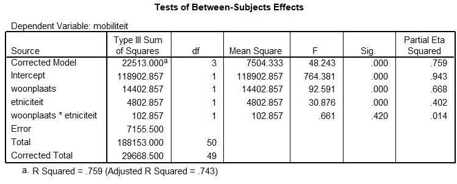

```{r, echo = FALSE, results = "hide"}
include_supplement("uu-Twoway-ANOVA-825-nl-tabel.jpg", recursive = TRUE)
```

Question
========
  
A study by M. van den Berg (2006), researcher and lecturer at Erasmus University Rotterdam, looks at the social mobility of immigrant and native women. It also looks at the difference between urban and rural areas. Social mobility is measured in terms of social and financial advancement. The study assumes that immigrant women living in cities have more social mobility than immigrant women living in rural areas.

The output below shows the results of Van den Berg's study (n = 50).




What is the result? 
Answerlist
----------
* There is only a main effect of residence.
* There is both a main effect of residence and a main effect of ancestry.
* There is only an interaction effect.
* This cannot be determined based on the above information.


Solution
========

Meta-information
================
exname: uu-Twoway-ANOVA-825-en
extype: schoice
exsolution: 0100
exsection: Inferential Statistics/Parametric Techniques/ANOVA/Twoway ANOVA
exextra[Type]: Interpretating output
exextra[Program]: SPSS
exextra[Language]: English
exextra[Level]: Statistical Literacy
