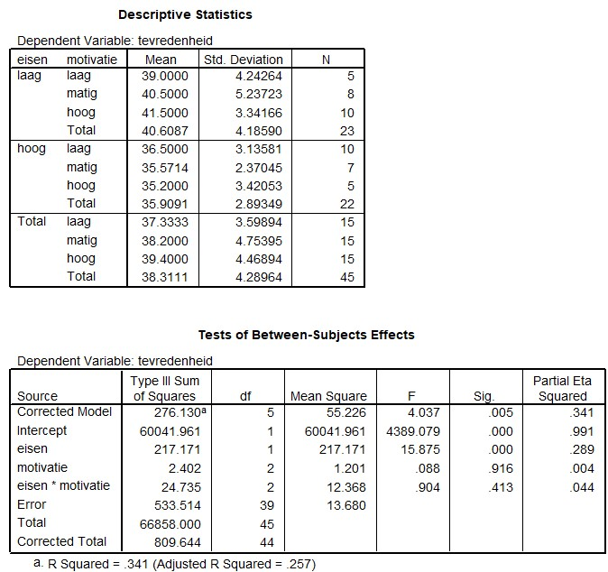

```{r, echo = FALSE, results = "hide"}
include_supplement("uu-Twoway-ANOVA-826-nl-tabel.jpg", recursive = TRUE)
```

Question
========
  
The study by Danielle Mohren of Maastricht University identifies two factors that influence employee job satisfaction. Namely, an employer's demands (high or low) and the employee's own motivation (high-moderate-low). It is expected that employees TRUE of high demands are less satisfied with their work than colleagues TRUE of lower demands. For her study, the researcher used questionnaires for 27,000 employees; more than 12,000 responded. A higher score on the satisfaction measure means the person is more satisfied.

The output below matches the results of Mohren's study. 



Is the researcher's hypothesis accepted based on the above results? 
Answerlist
----------

* Yes, because p > .05
* Yes, because p < .05
* No, because p > .05
* No, because p < .05

Solution
========

Meta-information
================
exname: uu-Twoway-ANOVA-826-en
extype: schoice
exsolution: 0100
exsection: Inferential Statistics/Parametric Techniques/ANOVA/Twoway ANOVA
exextra[ID]: 00faf
exextra[Type]: Interpretating output
exextra[Program]: SPSS
exextra[Language]: English
exextra[Level]: Statistical Literacy
