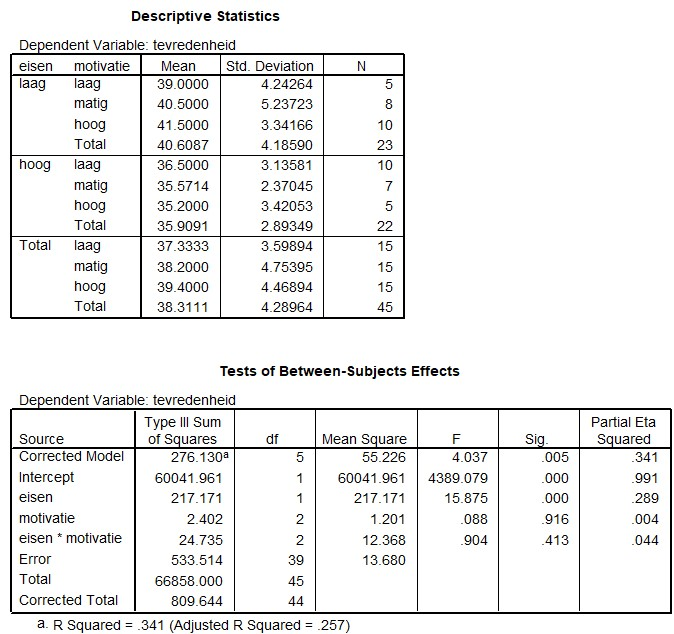

```{r, echo = FALSE, results = "hide"}
include_supplement("uu-Twoway-ANOVA-826-nl-tabel.jpg", recursive = TRUE)
```


Question
========
  
In het onderzoek van Danielle Mohren van de Universiteit Maastricht worden twee factoren geïdentificeerd die van invloed zijn op arbeidstevredenheid van werknemers. Namelijk de eisen die een werkgever stelt (hoog of laag) en de motivatie van de werknemer zelf (hoog-matig-laag). Er wordt verwacht dat werknemers waar hoge eisen aan worden gesteld, minder tevreden zijn over hun werk dan collega’s waar minder eisen aan worden gesteld. Voor haar onderzoek gebruikte de onderzoekster vragenlijsten voor 27.000 werknemers, ruim 12.000 reageerden. Een hogere score op de tevredenheidsmeting betekent dat de persoon meer tevreden is.

De onderstaande output komt overeen met de resultaten van het onderzoek van Mohren. 




Wordt de hypothese van de onderzoeker op basis van bovenstaande resultaten aangenomen? 
  
Answerlist
----------

* Ja, want p > .05
* Ja, want p < .05
* Nee, want p > .05
* Nee, want p < .05


Solution
========


Meta-information
================
exname: uu-Twoway-ANOVA-826-nl.Rmd
extype: schoice
exsolution: 0100
exsection: Inferential Statistics/Parametric Techniques/ANOVA/Twoway ANOVA
exextra[Type]: Interpretating output
exextra[Program]: SPSS
exextra[Language]: Dutch
exextra[Level]: Statistical Literacy
