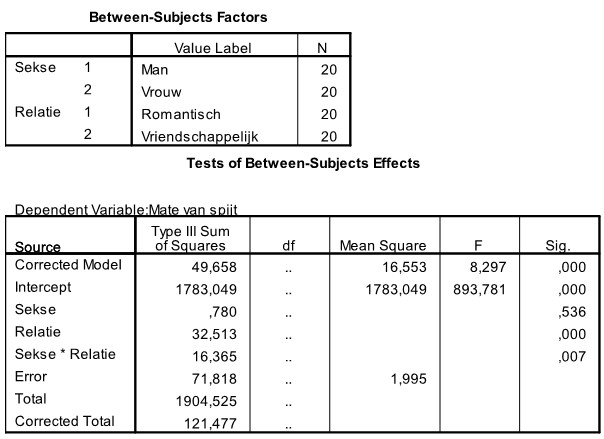

```{r, echo = FALSE, results = "hide"}
include_supplement("uu-Twoway-ANOVA-828-nl-tabel.jpg", recursive = TRUE)
```


Question
========
  
In 2006 is er een onderzoek uitgevoerd naar gevoelens van spijt ten aanzien van relaties en verschillen in die gevoelens tussen mannen en vrouwen. De proefgroep bestond uit 40 vrouwen en 29 mannen, gemiddelde leeftijd 19 jaar (sd = 1.18). Elke deelnemer heeft een vragenlijst ingevuld volgens de volgende instructies: 
Als je terugkijkt op je relatie is er dan iets waar je echt veel spijt van hebt? Iets dat je anders had willen doen. Iets waar je wel of juist geen actie had willen ondernemen. 
Teun en Gijs moeten voor hun statistiekcursus een onderzoekje doen. Na het lezen van een artikel over het onderzoek naar spijtgevoelens hebben ze zelf een soortgelijk onderzoek gedaan. Samen hebben ze een lijstje opgesteld met potentieel genante of ongemakkelijke situaties die in relaties voorkomen (de vraag “Ben ik te dik?” met “Ja” beantwoorden, samen naar de sauna, enz.). Veertig medestudenten worden gevraagd om mee te werken aan dit onderzoek: 20 vrouwelijke studenten en 20 mannelijke studenten. Ze worden gevraagd aan te geven hoeveel spijt ze hebben van de beschreven situaties (waar 0 ‘geen spijt’ en 10 ‘heel erg veel spijt’ betekent). De helft van de vrouwen en de helft van de mannen wordt gevraagd de vragen te beantwoorden over een romantische relatie (een vaste vriend of vriendin), de andere helft wordt gevraagd dit te doen over een vriendschappelijke relatie (een goede vriend of vriendin). 

SPSS output van de analyseresultaten van de verzamelde data is hieronder gegeven. 




Wat is de waarde van de toetsingsgrootheid die de verschillen in mate van spijt-scores toetst tussen de romantische relaties en de vriendschappelijke relaties?
  
Answerlist
----------
* 8.297
* 0.391
* 16.298 
* 8.203


Solution
========
  


Meta-information
================
exname: uu-Twoway-ANOVA-828-nl.Rmd
extype: schoice
exsolution: 0010
exsection: Inferential Statistics/Parametric Techniques/ANOVA/Twoway ANOVA
exextra[ID]: c77da
exextra[Type]: Interpretating output
exextra[Program]: SPSS
exextra[Language]: Dutch
exextra[Level]: Statistical Literacy
