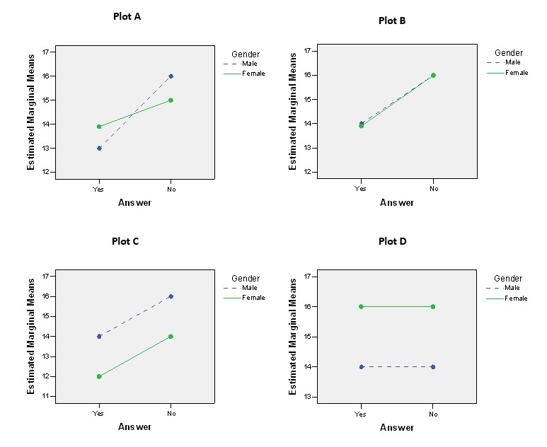

```{r, echo = FALSE, results = "hide"}
include_supplement("uu-Twoway-ANOVA-829-nl-tabel.jpg", recursive = TRUE)
```


Question
========
  
A two-way ANOVA was conducted with the first factor Gender (male/ female) and the second factor Answer (yes/no). Four profile plots are shown below. Which of the four profile plots show a main effect for one of the factors, but not for the other?


  
Answerlist
----------
* Plot C and Plot B
* Plot C and Plot D
* Plot A, Plot B and Plot D
* All four plots


Solution
========
  


Meta-information
================
exname: uu-Twoway-ANOVA-829-en.Rmd
extype: schoice
exsolution: 0010
exsection: Inferential Statistics/Parametric Techniques/ANOVA/Twoway ANOVA
exextra[Type]: Interpretating output
exextra[Program]: SPSS
exextra[Language]: English
exextra[Level]: Statistical Literacy
