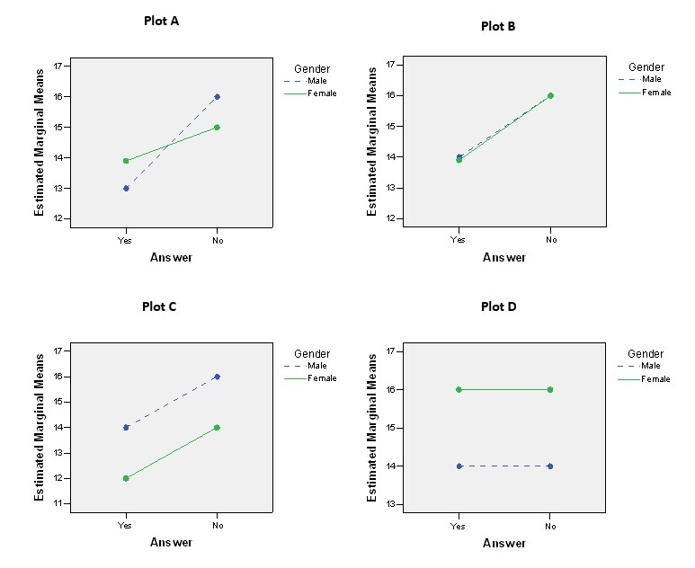

```{r, echo = FALSE, results = "hide"}
include_supplement("uu-Twoway-ANOVA-829-nl-tabel.jpg", recursive = TRUE)
```

Question
========
  
Er werd een tweezijdige ANOVA uitgevoerd met de eerste factor Geslacht (man/vrouw) en de tweede factor Antwoord (ja/nee). Hieronder worden vier profielplots getoond. Welke van de vier profielplots vertoont een hoofdeffect voor een van de factoren, maar niet voor de andere?


  
Antwoordlijst
----------
* Plot C en Plot B
* Plot C en Plot D
* Perceel A, perceel B en perceel D
* Alle vier de plots


Solution
========

Meta-information
================
exname: uu-Twoway-ANOVA-829-nl
extype: schoice
exsolution: 0010
exsection: Inferential Statistics/Parametric Techniques/ANOVA/Twoway ANOVA
exextra[Type]: Interpretating output
exextra[Program]: SPSS
exextra[Language]: Dutch
exextra[Level]: Statistical Literacy
