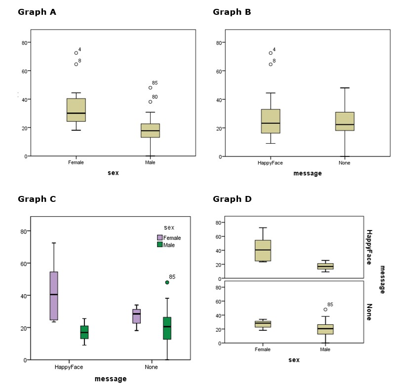

```{r, echo = FALSE, results = "hide"}
include_supplement("uu-Twoway-ANOVA-831-en-tabel.jpg", recursive = TRUE)
```


Question
========
A two-way ANOVA is used to compare the tip percentage received by male and female waiters. Half of the waiters drew a smiley face on the receipt. The other half didn’t. One of the assumptions of a two-way ANOVA is the assumption of equal variances. Which of the graphs shown below can be used to check this assumption? 


  
Answerlist
----------
* All four graphs 
* Graph A and graph B 
* Graph A and graph D 
* Graph C and graph D 


Solution
========
  


Meta-information
================
exname: uu-Twoway-ANOVA-831-en.Rmd
extype: schoice
exsolution: 0001
exsection: Inferential Statistics/Parametric Techniques/ANOVA/Twoway ANOVA
exextra[ID]: 06499
exextra[Type]: Interpretating output
exextra[Program]: SPSS
exextra[Language]: English
exextra[Level]: Statistical Literacy
