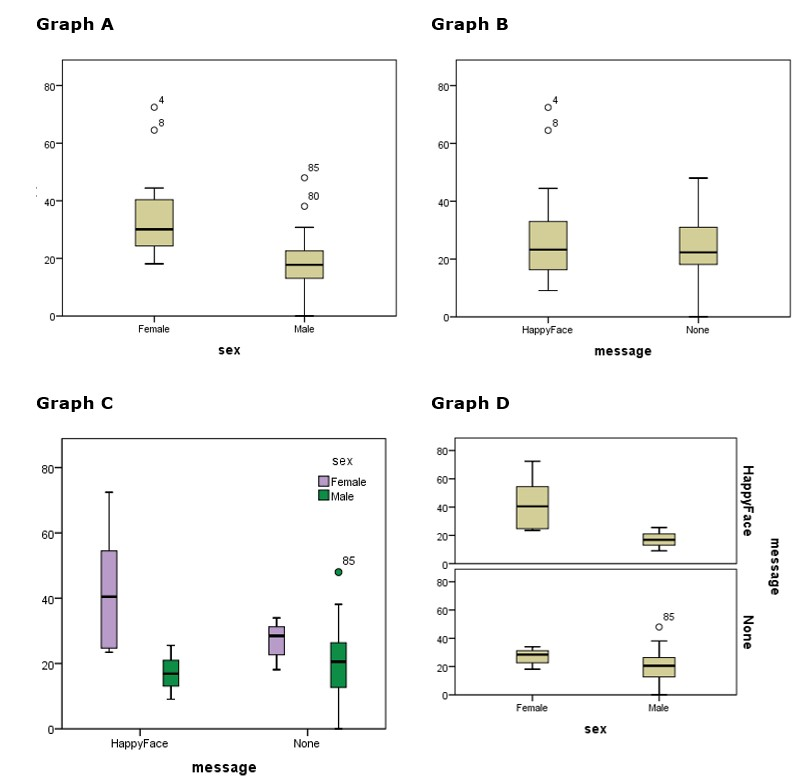

```{r, echo = FALSE, results = "hide"}
include_supplement("uu-Twoway-ANOVA-831-en-tabel.jpg", recursive = TRUE)
```

Question
========
Een tweezijdige ANOVA wordt gebruikt om het fooipercentage dat mannelijke en vrouwelijke obers ontvangen te vergelijken. De helft van de obers tekende een smiley op de bon. De andere helft deed dat niet. Een van de assumpties van een tweezijdige ANOVA is de aanname van gelijke varianties. Welke van de grafieken hieronder kan gebruikt worden om deze assumptie te controleren? 


  
Answerlist
----------
* Alle vier de grafieken
* Grafiek A en grafiek B
* Grafiek A en grafiek D
* Grafiek C en grafiek D 

Solution
========

Meta-information
================
exname: uu-Twoway-ANOVA-831-nl
extype: schoice
exsolution: 0001
exsection: Inferential Statistics/Parametric Techniques/ANOVA/Twoway ANOVA
exextra[ID]: 79ba7
exextra[Type]: Interpretating output
exextra[Program]: SPSS
exextra[Language]: Dutch
exextra[Level]: Statistical Literacy
