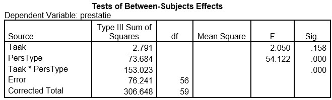

```{r, echo = FALSE, results = "hide"}
include_supplement("uu-Twoway-ANOVA-832-nl-tabel.jpg", recursive = TRUE)
```


Question
========
  
In het onderzoek van Fazio et al. (1981) vergelijken de onderzoekers het verschil in prestatie tussen twee persoonlijkheidstypes (type A en type B) op twee taken (single en multiple). De proefpersonen worden at random verdeeld over de twee condities. In de single conditie wordt de proefpersoon gevraagd fouten in een tekst aan te strepen. In de multiple conditie wordt de proefpersoon hetzelfde gevraagd maar wordt daarbij regelmatig onaangekondigd een korte andere opdracht gegeven.
In totaal wordt in beide condities 10 minuten besteed aan het opsporen van fouten in de tekst. Het aantal fouten dat correct wordt gevonden is het prestatieniveau. Er is getoetst bij $\alpha$ = 5%.

De hypotheses die de onderzoekers opstellen, zeggen dat er geen hoofdeffecten zijn en dat er wel een interactie-effect is. De hypothese die Fazio et al. opgesteld heeft over de interactie luidt: mensen met Type A persoonlijkheid worden uitgedaagd door de multiple taak en gaan daar beter van presteren; mensen met Type B persoonlijkheid worden daarentegen afgeleid door de multiple taak en gaan slechter presteren. 

Een jaar later wordt het experiment van Fazio et al. nog een keer uitgevoerd. Een deel van de SPSS-output van de tweeweg-ANOVA staat hieronder.




De onderzoekers zijn geïnteresseerd in de sterkte van het interactie-effect. Hoeveel procent van de spreiding in de prestaties wordt verklaard door het interactie-effect?
  
Answerlist
----------
* .23
* .24
* .49 
* .67 

Solution
========
  


Meta-information
================
exname: uu-Twoway-ANOVA-832-nl.Rmd
extype: schoice
exsolution: 0001
exsection: Inferential Statistics/Parametric Techniques/ANOVA/Twoway ANOVA
exextra[ID]: 16bbf
exextra[Type]: Interpretating output
exextra[Program]: SPSS
exextra[Language]: Dutch
exextra[Level]: Statistical Literacy
