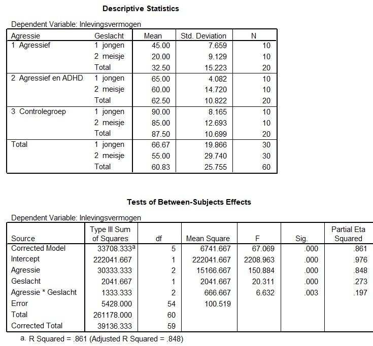

```{r, echo = FALSE, results = "hide"}
include_supplement("uu-Twoway-ANOVA-833-nl-tabel.jpg", recursive = TRUE)
```

Question
========
  
A study by Wiede et al. (2005) looked at the amount of empathy (empathy) of aggressive children between the ages of 8 and 12, also looking at the difference between boys and girls. Here a distinction is made between aggressive children, aggressive children also diagnosed with ADHD, and children without behavioral problems (control group). Empathy is measured by showing a video of a boy falling off his bicycle, followed by a questionnaire that can be scored on a scale from 0 to 100.

The output below belongs to this study.




What is the result of the Two-way ANOVA? 
Answerlist
----------
* Both the main effects and the interaction effect are not significant.
* Only the main effects are significant
* Only the interaction effect is significant
* Both the main effects and the interaction effect are significant.


Solution
========

Meta-information
================
exname: uu-Twoway-ANOVA-833-en
extype: schoice
exsolution: 0001
exsection: Inferential Statistics/Parametric Techniques/ANOVA/Twoway ANOVA
exextra[Type]: Interpretating output
exextra[Program]: SPSS
exextra[Language]: English
exextra[Level]: Statistical Literacy
