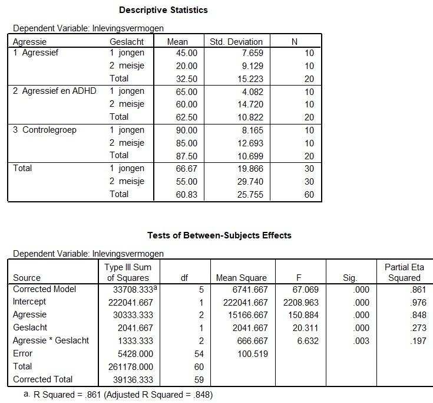

```{r, echo = FALSE, results = "hide"}
include_supplement("uu-Twoway-ANOVA-833-nl-tabel.jpg", recursive = TRUE)
```


Question
========
  
In een onderzoek van Wiede et al. (2005) wordt er gekeken naar de hoeveelheid empathie (inlevingsvermogen) van agressieve kinderen tussen de 8 en 12 jaar, waarbij ook gekeken wordt naar het verschil tussen jongens en meisjes. Hierbij is er onderscheid gemaakt tussen agressieve kinderen, agressieve kinderen die ook met ADHD gediagnosticeerd zijn, en kinderen zonder gedragsproblemen (controlegroep). Empathie wordt gemeten door een video te laten zien van een jongetje die van zijn fiets valt, waarna er een vragenlijst wordt afgenomen die gescoord kan worden op een schaal van 0 tot 100.

Onderstaande output hoort bij dit onderzoek.




Wat is het resultaat van de Two-way ANOVA?
  
Answerlist
----------
* Zowel de hoofdeffecten als het interactie-effect zijn niet significant.
* Alleen de hoofdeffecten zijn significant
* Alleen het interactieffect is significant
* Zowel de hoofdeffecten als het interactie-effect zijn significant.


Solution
========
  


Meta-information
================
exname: uu-Twoway-ANOVA-833-nl.Rmd
extype: schoice
exsolution: 0001
exsection: Inferential Statistics/Parametric Techniques/ANOVA/Twoway ANOVA
exextra[Type]: Interpretating output
exextra[Program]: SPSS
exextra[Language]: Dutch
exextra[Level]: Statistical Literacy
