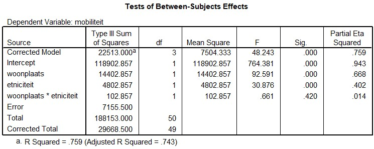

```{r, echo = FALSE, results = "hide"}
include_supplement("uu-Twoway-ANOVA-834-nl-tabel.jpg", recursive = TRUE)
```


Question
========
  
In een onderzoek van M. van den Berg (2006), onderzoeker en docente aan de Erasmus Universiteit Rotterdam, wordt gekeken naar de sociale mobiliteit van allochtone vrouwen en autochtone vrouwen. Daarbij wordt er ook gekeken naar het verschil tussen stad en platteland. Sociale mobiliteit wordt gemeten in termen van sociale en financiële vooruitgang. In het onderzoek wordt verondersteld dat allochtone vrouwen die in de stad wonen meer sociale mobiliteit hebben dan allochtone vrouwen op het platteland.

In onderstaande output is af te lezen wat de resultaten zijn van het onderzoek van Van den Berg (n = 50).




In de bovenstaande ANOVA tabel ontbreekt de waarde van Mean Square -- Error. Wat is de correcte waarde hiervan?
  
Answerlist
----------
* 7155.500
* 7504.333
* 155.554
* 152.245


Solution
========
  


Meta-information
================
exname: uu-Twoway-ANOVA-834-nl.Rmd
extype: schoice
exsolution: 0010
exsection: Inferential Statistics/Parametric Techniques/ANOVA/Twoway ANOVA
exextra[Type]: Interpretating output
exextra[Program]: SPSS
exextra[Language]: Dutch
exextra[Level]: Statistical Literacy
