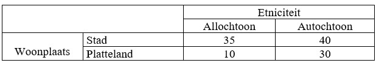

```{r, echo = FALSE, results = "hide"}
include_supplement("uu-Twoway-ANOVA-835-nl-tabel.jpg", recursive = TRUE)
```


Question
========
At Maastricht University, Van den Berg's research is replicated (without a third variable). The table below shows the result of the study. What type of effect is visible in the table below? (N.B. the numbers represent group averages).



  
Answerlist
----------
* A main effect of ethnicity and an interaction effect.
* A main effect of residence and an interaction effect.
* A main effect of both ethnicity and residence and an interaction effect.
* A main effect of both ethnicity and place of residence and no interaction effect.


Solution
========

Meta-information
================
exname: uu-Twoway-ANOVA-835-en
extype: schoice
exsolution: 0010
exsection: Inferential Statistics/Parametric Techniques/ANOVA/Twoway ANOVA
exextra[ID]: 2369b
exextra[Type]: Interpretating output
exextra[Program]: SPSS
exextra[Language]: English
exextra[Level]: Statistical Literacy
