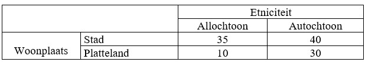

```{r, echo = FALSE, results = "hide"}
include_supplement("uu-Twoway-ANOVA-835-nl-tabel.jpg", recursive = TRUE)
```


Question
========
Aan de universiteit van Maastricht wordt het onderzoek van Van den Berg gerepliceerd 
(zonder derde variabele). De onderstaande tabel geeft het resultaat van het onderzoek weer. 
Welk soort effect is in onderstaande tabel zichtbaar? (N.B. de getallen staan voor 
groepsgemiddelden).



  
Answerlist
----------
* Een hoofdeffect van etniciteit en een interactie-effect.
* Een hoofdeffect van woonplaats en een interactie-effect.
* Een hoofdeffect van zowel etniciteit als woonplaats en een interactie-effect.
* Een hoofdeffect van zowel etniciteit als woonplaats en geen interactie-effect.


Solution
========
  


Meta-information
================
exname: uu-Twoway-ANOVA-835-nl.Rmd
extype: schoice
exsolution: 0010
exsection: Inferential Statistics/Parametric Techniques/ANOVA/Twoway ANOVA
exextra[Type]: Interpretating output
exextra[Program]: SPSS
exextra[Language]: Dutch
exextra[Level]: Statistical Literacy
