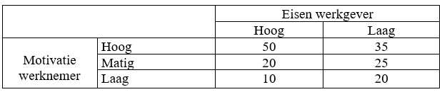

```{r, echo = FALSE, results = "hide"}
include_supplement("uu-Twoway-ANOVA-836-nl-tabel.jpg", recursive = TRUE)
```

Question
========
  
The study by Danielle Mohren of Maastricht University identifies two factors that influence employee job satisfaction. Namely, an employer's demands (high or low) and the employee's own motivation (high-moderate-low). It is expected that employees TRUE of high demands are less satisfied with their work than colleagues TRUE of lower demands. For her study, the researcher used questionnaires for 27,000 employees; more than 12,000 responded. A higher score on the satisfaction measure means the person is more satisfied.


You decide to replicate Mohren's research. The table below shows your results. What effect(s) is/are visible?



  
Answerlist
----------
* A main effect of requirements employer and an interaction effect.
* A main effect of motivation employee and an interaction effect.
* A main effect of both requirements employer and motivation employee, and also an interaction effect.
* A main effect of both requirements employer and motivation employee, and no interaction effect.


Solution
========

Meta-information
================
exname: uu-Twoway-ANOVA-836-en
extype: schoice
exsolution: 0100
exsection: Inferential Statistics/Parametric Techniques/ANOVA/Twoway ANOVA
exextra[ID]: 11156
exextra[Type]: Interpretating output
exextra[Language]: English
exextra[Level]: Statistical Literacy
