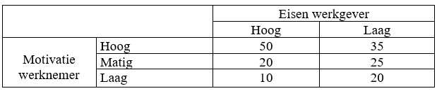

```{r, echo = FALSE, results = "hide"}
include_supplement("uu-Twoway-ANOVA-836-nl-tabel.jpg", recursive = TRUE)
```


Question
========
  
In het onderzoek van Danielle Mohren van de Universiteit Maastricht worden twee factoren geïdentificeerd die van invloed zijn op arbeidstevredenheid van werknemers. Namelijk de eisen die een werkgever stelt (hoog of laag) en de motivatie van de werknemer zelf (hoog-matig-laag). Er wordt verwacht dat werknemers waar hoge eisen aan worden gesteld, minder tevreden zijn over hun werk dan collega’s waar minder eisen aan worden gesteld. Voor haar onderzoek gebruikte de onderzoekster vragenlijsten voor 27.000 werknemers, ruim 12.000 reageerden. Een hogere score op de tevredenheidsmeting betekent dat de persoon meer tevreden is.


Jij besluit het onderzoek van Mohren te repliceren. Onderstaande tabel geeft jouw resultaten weer. Welk(e) effect(en) is/zijn zichtbaar?



  
Answerlist
----------
* Een hoofdeffect van eisen werkgever en een interactie-effect.
* Een hoofdeffect van motivatie werknemer en een interactie-effect.
* Een hoofdeffect van zowel eisen werkgever als motivatie werknemer, en ook een interactie-effect.
* Een hoofdeffect van zowel eisen werkgever als motivatie werknemer, en geen interactie-effect.


Solution
========
  


Meta-information
================
exname: uu-Twoway-ANOVA-836-nl.Rmd
extype: schoice
exsolution: 0100
exsection: Inferential Statistics/Parametric Techniques/ANOVA/Twoway ANOVA
exextra[Type]: Interpretating output
exextra[Language]: Dutch
exextra[Level]: Statistical Literacy
